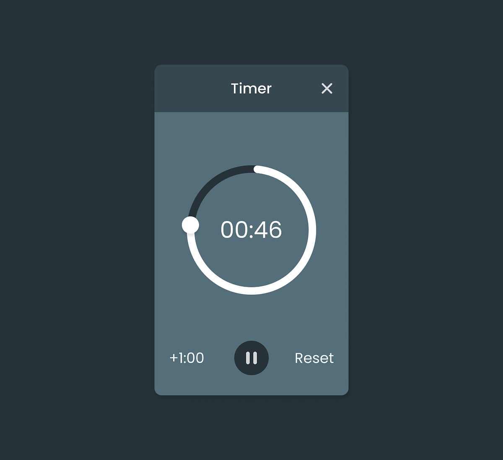
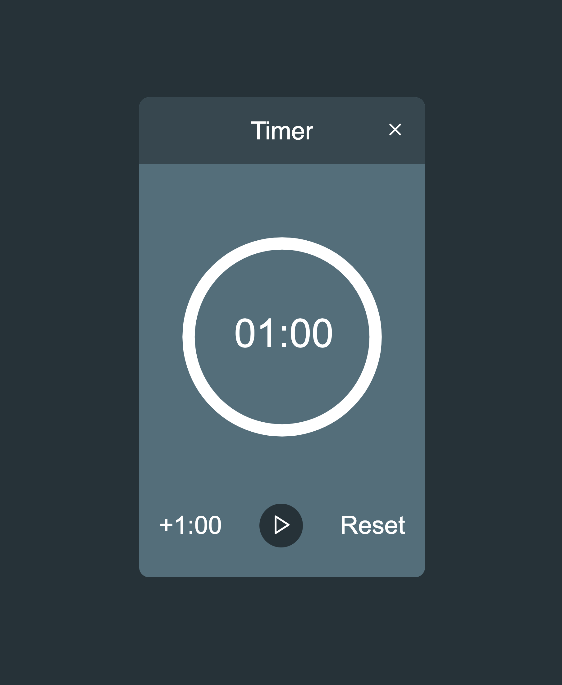
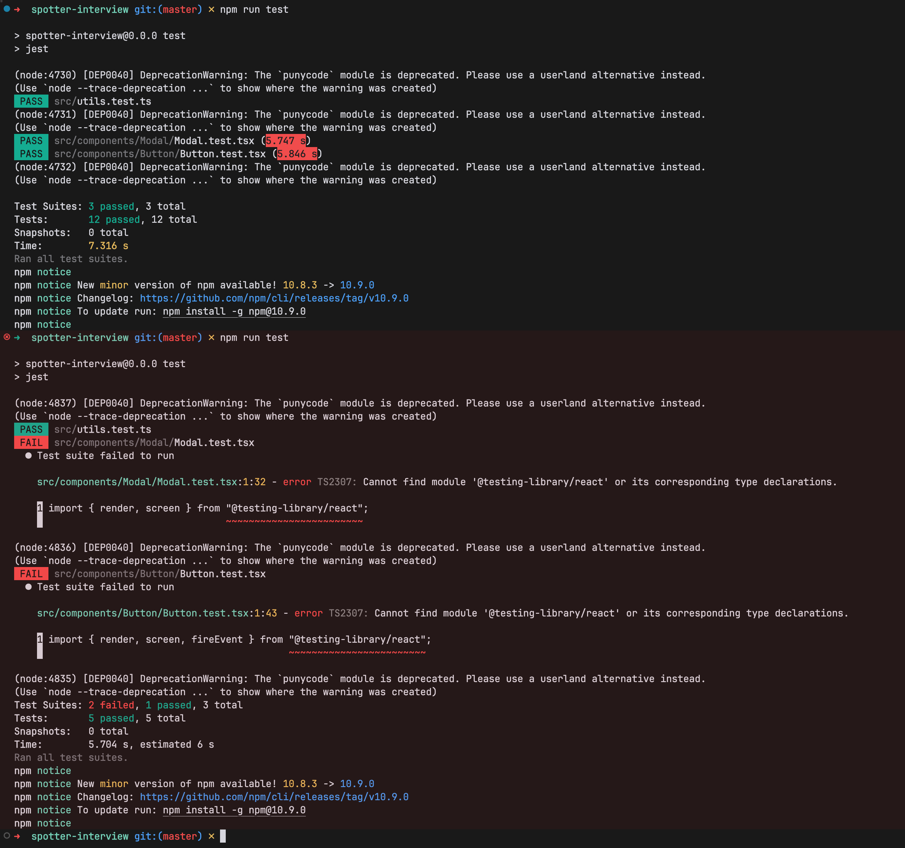

# Spotter Timer App

A simple timer application built with Vite and React.
| Design | My Implementation |
|--------|------------------|
|  |  |

Here is a loom video of me walking through the code and explaining my thought process.

[Loom Video](https://www.loom.com/share/c8cfb832090d43db8ceb83e88d8ce7a4?sid=479f62bd-f350-483d-8912-20624378a070)

## Overview

The general steps I took to build this app were:

1. Define all criteria
2. Break down features and components as tasks
3. Decide on appropriate tooling and libraries
4. Get functionality working
5. Style
6. Code review my own code and refine
7. Add bonus features

### Technical Decisions

- **Development Tools**: Used Cursor editor and Sonnet LLM to accelerate development. Code reviewed, and refactored until code met my standards and best practices.
- **Vite**: Chosen as the build tool for its simplicity and speed, as Next.js would have been overengineered for this use case
- **Clever Library**: Initially implemented custom time input formatting logic, but switched to Clever library for more reliable and bug-free input handling
- **Test Coverage**: Added comprehensive unit tests to ensure code reliability
- **Emotion Styled Components**: Used for styling components due to its CSS-in-JS capabilities and seamless integration with React

## Getting Started

### Installation

1. Clone the repository
2. Run `npm install` to install dependencies
3. Run `npm run dev` to start the development server
4. The application will be available at: http://localhost:5173/

## Known Issues and Challenges

### Testing Configuration

- Encountered intermittent issues with unit test execution
- Configuration inconsistencies caused tests to work sporadically

#### Here is a screenshot of jest working once but failing immediately after running again with no changes.

  

### Build Process

- Production build currently fails due to Jest errors
- Have not been able to configure Vite to exclude test files during production builds

## Future Improvements

If I had more time I would have:

- Add the draggable handle for the timer.
- Add more unit tests.
- Add Storybook stories for each component.
- Add more metadata.
- Add localization.
- Allow for multiple timers to run simultaneously.
